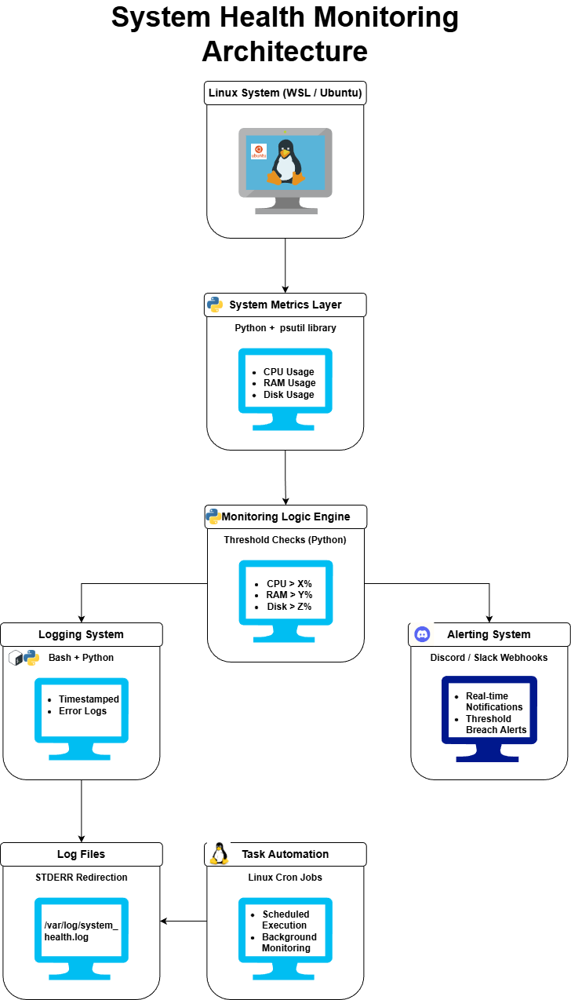

# Linux System Health Reporter

A lightweight Python-based monitoring tool that tracks system resource usage and sends automated alerts via Webhooks when thresholds are exceeded.

## Features
- **Real-time Monitoring**: Tracks CPU, RAM, and Disk usage percentages.
- **Automated Alerts**: Sends instant Discord/Slack notifications if usage exceeds 80%.
- **Persistent Logging**: Maintains a timestamped history of system health in a log file.
- **Task Scheduling**: Uses Linux Cron for fully automated background execution.

## Installation
1. Clone this repository:
   `git clone https://github.com/Nawaf1208/health_reporter.git`
2. Install dependencies:
   `pip install psutil requests`
3. Update the `webhook_url` in `health_reporter.py` with your own link.
4. Set permissions `chmod +x run_health_check.sh`

## Usage
### Manual Execution
- To perform a manual health check and update the logs immediately, run:
`./run_health_check.sh`
- To view the logs in real-time as they are generated:
`tail -f health_logs.txt`

### Automation with Crontab
To ensure the system is monitored continuously without manual intervention, use the Linux Cron daemon.
1. Open the crontab editor:
   `crontab -e`
2. Append the following line to schedule the check every 5 minutes:
   `*/5 * * * * /bin/bash /home/YOUR_USERNAME/health_reporter/run_health_check.sh`
